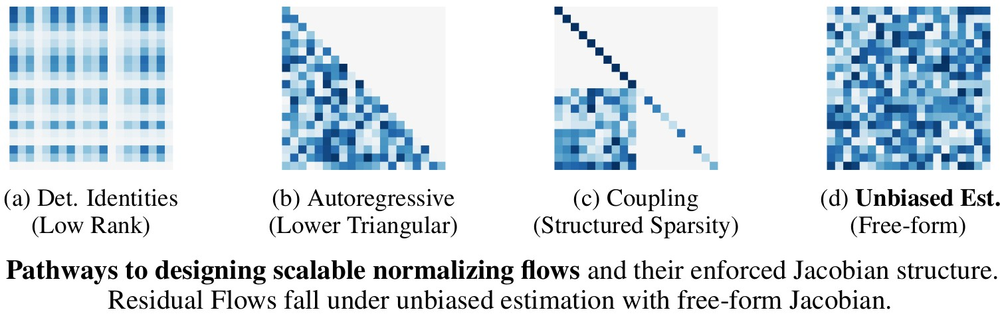
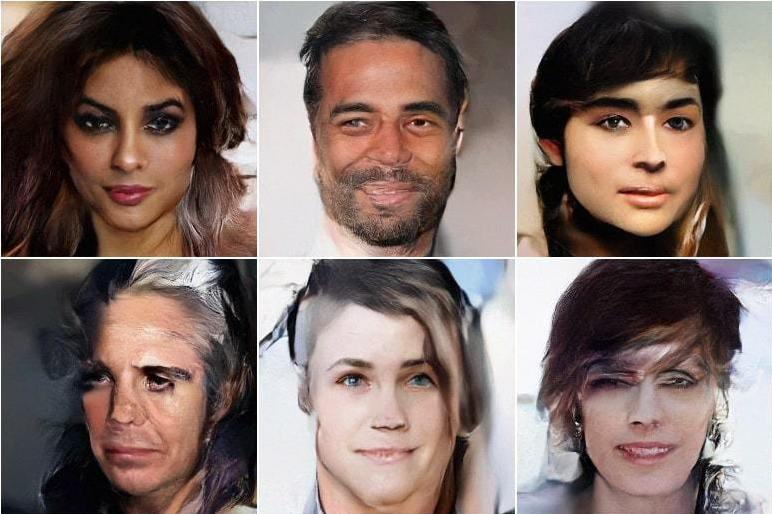

# Residual Flows for Invertible Generative Modeling [[arxiv](https://arxiv.org/abs/1906.02735)]

<p align="center">

</p>

Building on the use of [Invertible Residual Networks](https://arxiv.org/abs/1811.00995) in generative modeling, we propose:
+ Unbiased estimation of the log-density of samples.
+ Memory-efficient reformulation of the gradients.
+ LipSwish activation function.

As a result, Residual Flows scale to much larger networks and datasets.

<p align="center">

</p>

## Requirements

 - PyTorch 1.0+
 - Python 3.6+

## Preprocessing
ImageNet:
1. Follow instructions in `preprocessing/create_imagenet_benchmark_datasets`.
2. Convert .npy files to .pth using `preprocessing/convert_to_pth`.
3. Place in `data/imagenet32` and `data/imagenet64`.

CelebAHQ 64x64 5bit:

1. Download from https://github.com/aravindsrinivas/flowpp/tree/master/flows_celeba.
2. Convert .npy files to .pth using `preprocessing/convert_to_pth`.
3. Place in `data/celebahq64_5bit`.

CelebAHQ 256x256:
```
# Download Glow's preprocessed dataset.
wget https://storage.googleapis.com/glow-demo/data/celeba-tfr.tar
tar -C data/celebahq -xvf celeb-tfr.tar
python extract_celeba_from_tfrecords
```

## Density Estimation Experiments

***NOTE***: By default, O(1)-memory gradients are enabled. However, the logged bits/dim during training will not be an actual estimate of bits/dim but whatever scalar was used to generate the unbiased gradients. If you want to check the actual bits/dim for training (and have sufficient GPU memory), set `--neumann-grad=False`. Note however that the memory cost can stochastically vary during training if this flag is `False`.

MNIST:
```
python train_img.py --data mnist --imagesize 28 --actnorm True --wd 0 --save experiments/mnist
```

CIFAR10:
```
python train_img.py --data cifar10 --actnorm True --save experiments/cifar10
```

ImageNet 32x32:
```
python train_img.py --data imagenet32 --actnorm True --nblocks 32-32-32 --save experiments/imagenet32
```

ImageNet 64x64:
```
python train_img.py --data imagenet64 --imagesize 64 --actnorm True --nblocks 32-32-32 --factor-out True --squeeze-first True --save experiments/imagenet64
```

CelebAHQ 256x256:
```
python train_img.py --data celebahq --imagesize 256 --nbits 5 --actnorm True --act elu --batchsize 8 --update-freq 5 --n-exact-terms 8 --fc-end False --factor-out True --squeeze-first True --nblocks 16-16-16-16-16-16 --save experiments/celebahq256
```

## Pretrained Models

Model checkpoints can be downloaded from [releases](https://github.com/rtqichen/residual-flows/releases/latest).

Use the argument `--resume [checkpt.pth]` to evaluate or sample from the model. 

Each checkpoint contains two sets of parameters, one from training and one containing the exponential moving average (EMA) accumulated over the course of training. Scripts will automatically use the EMA parameters for evaluation and sampling.

## BibTeX
```
@inproceedings{chen2019residualflows,
  title={Residual Flows for Invertible Generative Modeling},
  author={Chen, Ricky T. Q. and Behrmann, Jens and Duvenaud, David and Jacobsen, J{\"{o}}rn{-}Henrik},
  booktitle = {Advances in Neural Information Processing Systems},
  year={2019}
}
```
